# Library Management
App is built on frappe
Librarian can manage Books,Members,Transaction using this app.

## Images
Books
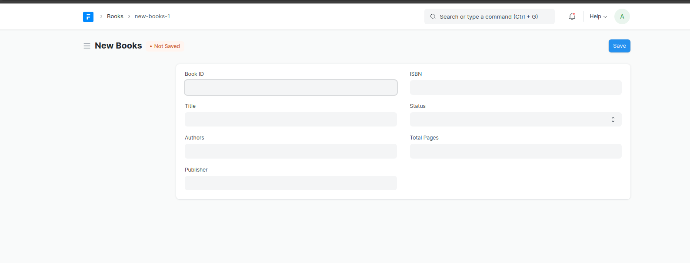
Importing Books
[Import Book - demo](https://user-images.githubusercontent.com/106061570/178661358-4ec77f4a-29ea-4382-8e56-ca9b8db9601e.webm)

Library Member
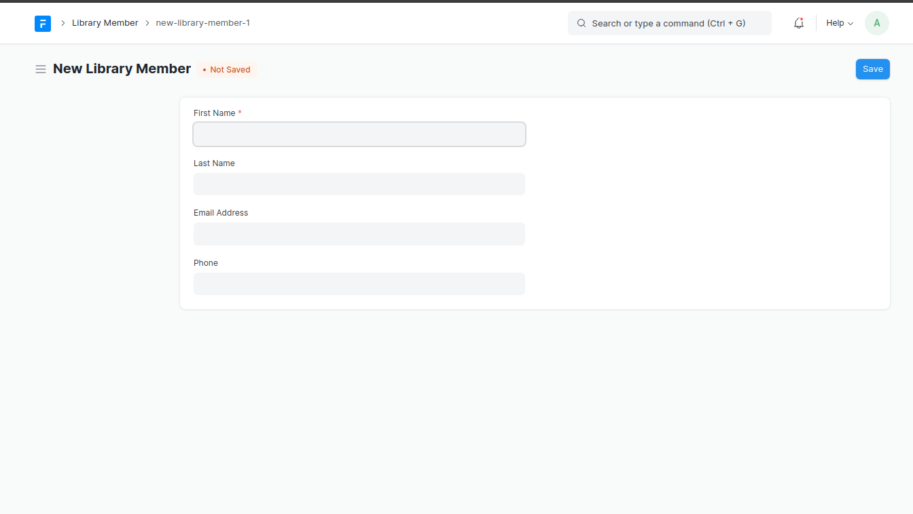
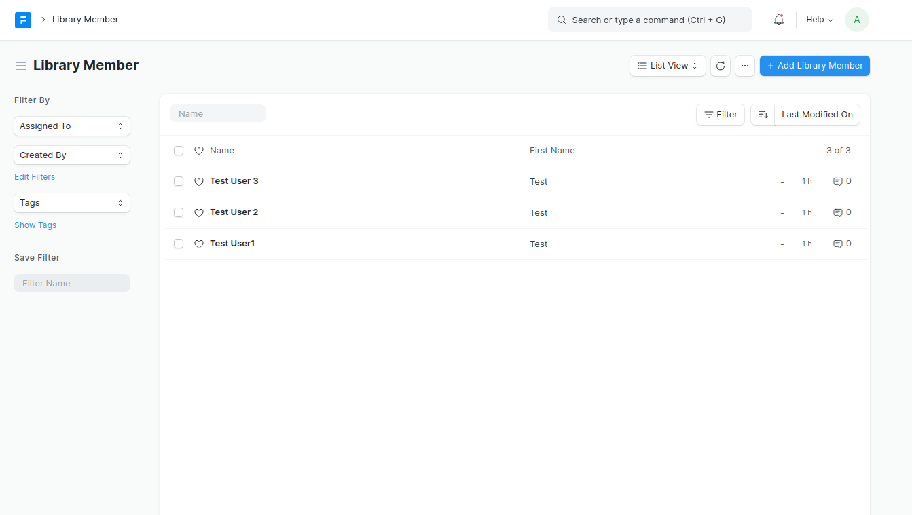

Library Membership
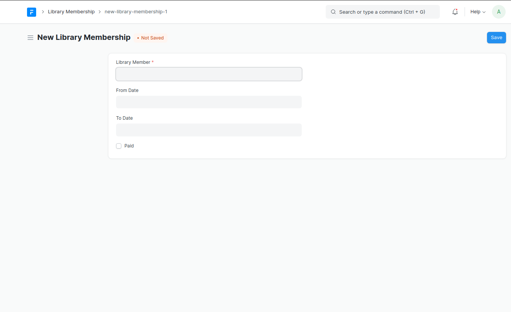
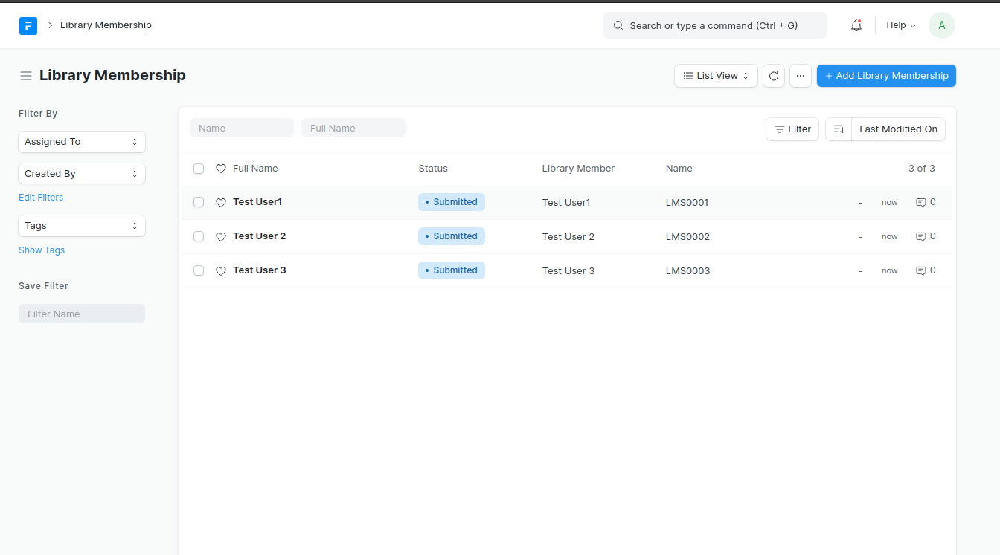

Library Transaction
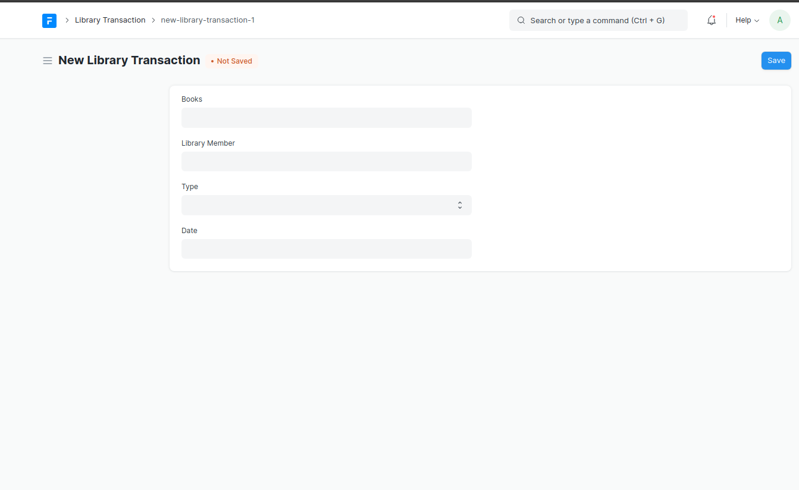
Issue
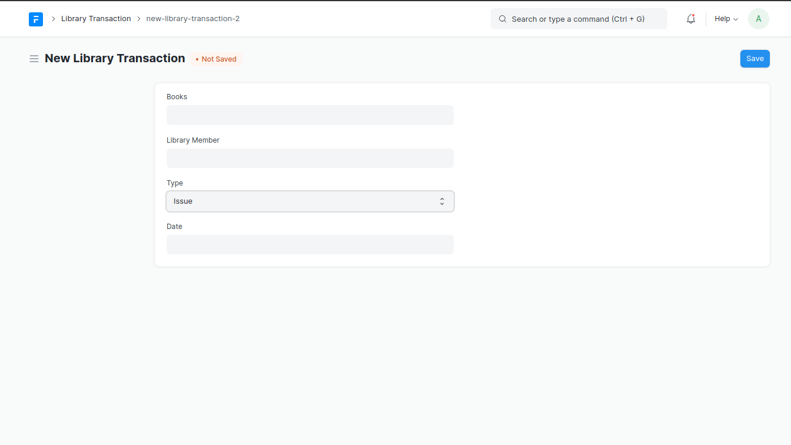
Return
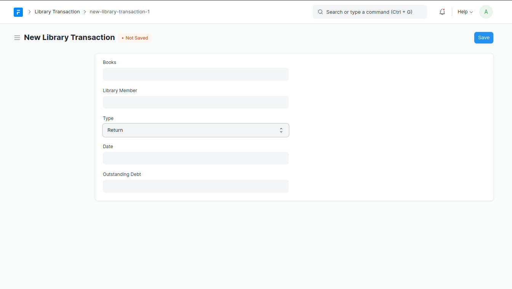
When Outstanding Debt is greater than 500
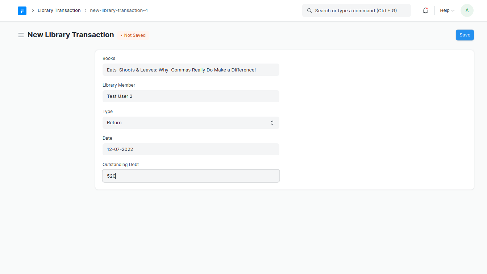
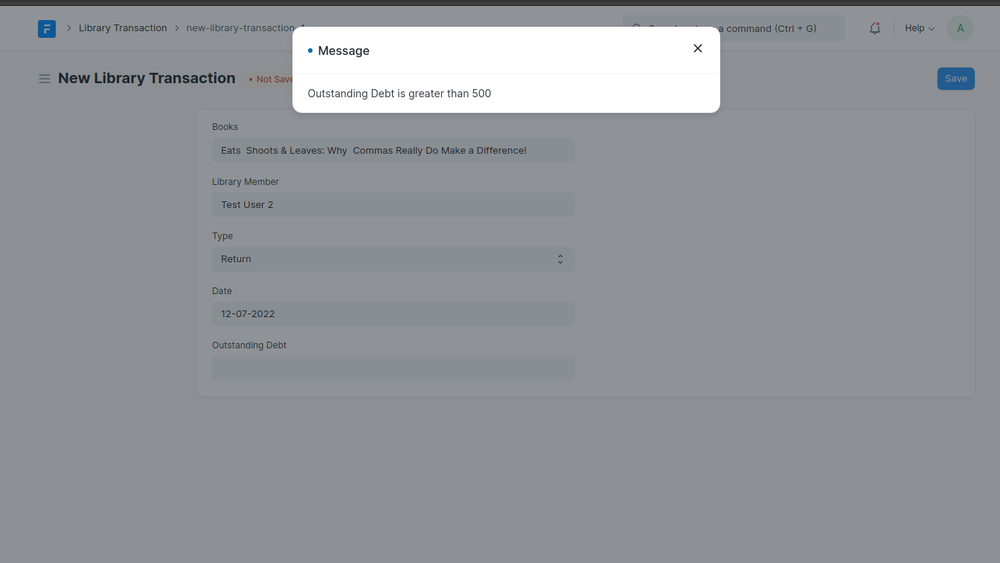
When member's Membership Is Expired
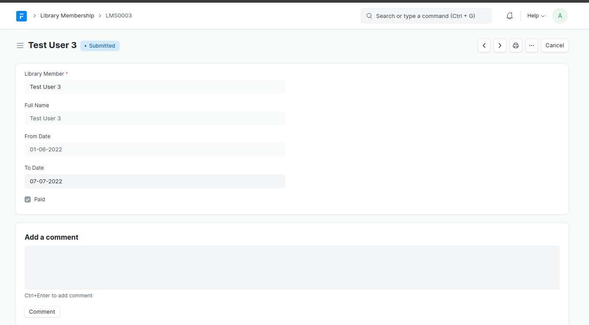
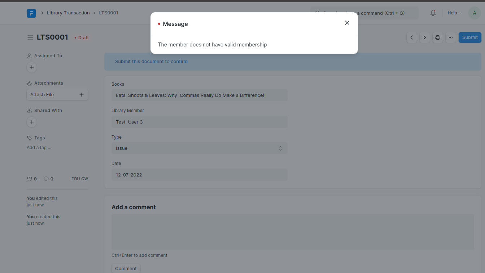
When Membership Is Valid
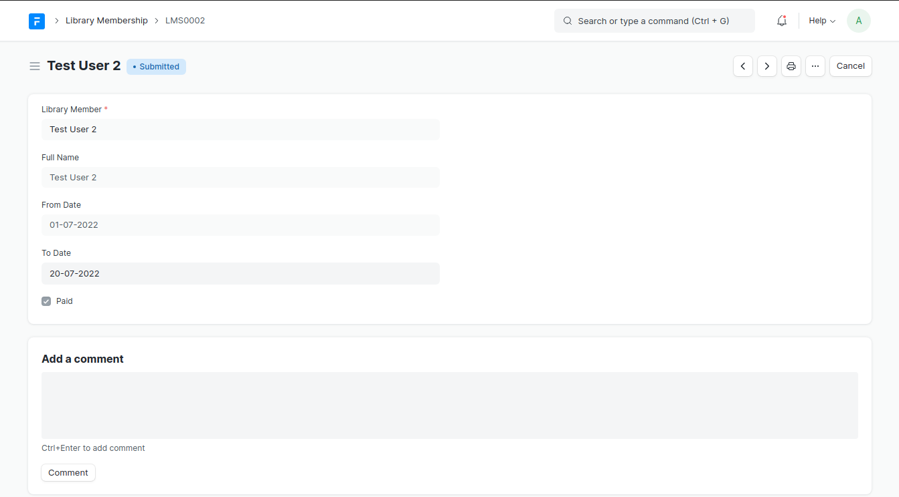
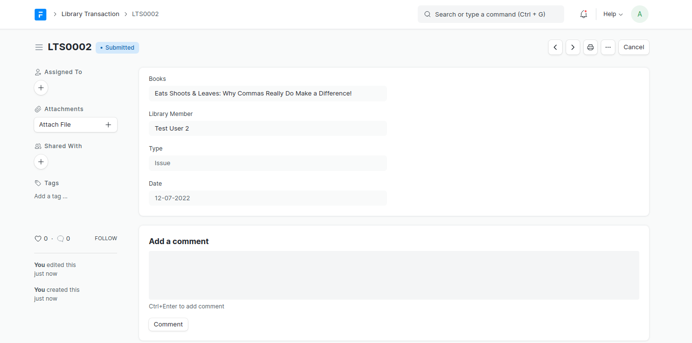
Book Issued
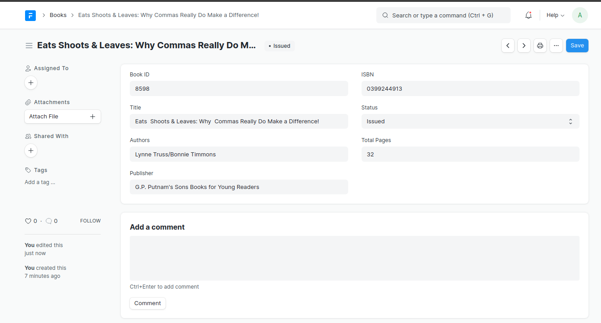
When Book is returned
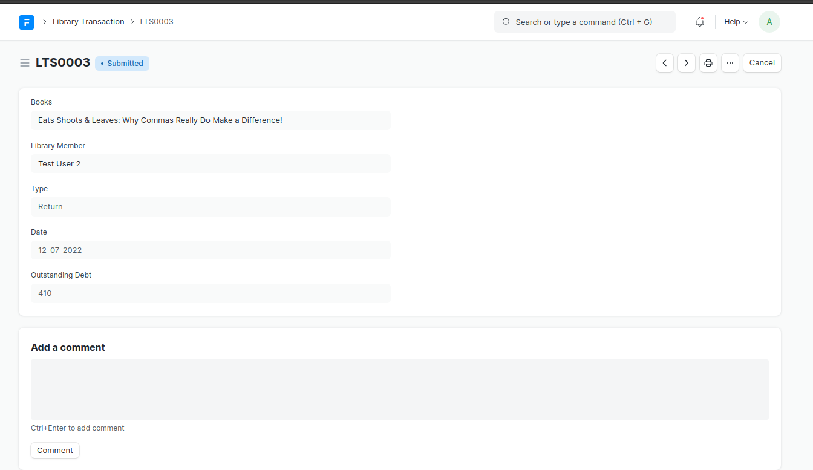
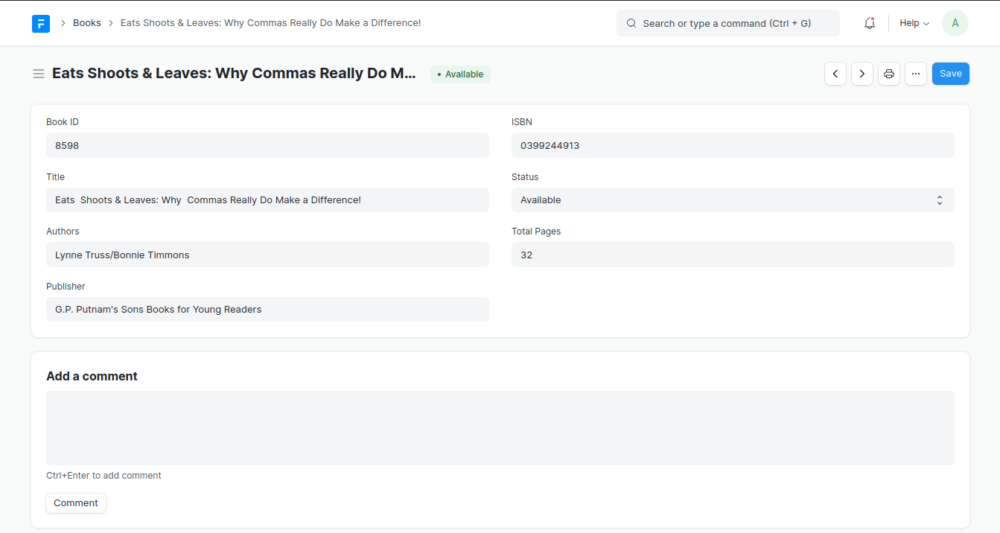
